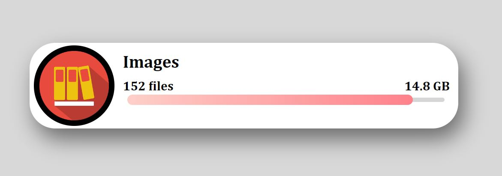

# File-Uploading-Animation

# File Uploading Animation

This is a design of the Files Uploading Animation on hover effect.

## Table of contents

- [Overview](#overview)
  - [The challenge](#the-challenge)
  - [Screenshot](#screenshot)
  - [Links](#links)
- [My process](#my-process)
  - [Built with](#built-with)
  - [What I learned](#what-i-learned)
- [Author](#author)

## Overview

### The challenge

Users should be able to:

- View the optimal animation on hovering your mouse to the card
- See hover states for all interactive elements on the page

### Screenshot



### Links

- Solution URL: [Github](https://github.com/zaidansari42/File-Uploading-Animation/)
- Live Site URL: [Live Website](https://zaidansari42.github.io/File-Uploading-Animation/)

## My process

### Built with

- Semantic HTML5 markup
- CSS custom properties

### What I learned

I learned how to create a beautiful animation with only HTML & CSS.

```css
 {
  background: linear-gradient(90deg, #fecfc8, #fe818a);

  height: 1.2rem;
  width: 0;
  border-radius: inherit;

  animation: load 2s forwards ease-in-out;
}
```

## Author

- Website - [Zaid Ansari](https://github.com/zaidansari42/)
- Twitter - [@zaidnasari42](https://www.twitter.com/zaidnasari42)
